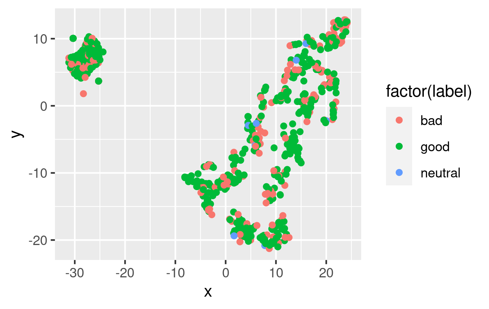
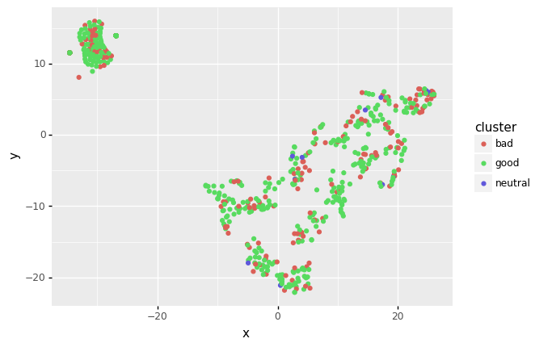
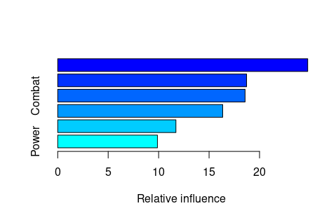

# Table of Contents

1.  [Q1](#org0f04966)
2.  [Q2](#org6a81eeb)
3.  [Q3](#org51a4194)
4.  [Q4](#org61f5d14)
5.  [Q5](#orgb73f6b4)
6.  [Q6](#org870b507)
7.  [Q7](#orge0cfd1d)

# Q1

With the data set given here:

<https://raw.githubusercontent.com/Vincent-Toups/bios611-project1/master/source_data/datasets_26073_33239_weight-height.csv>

Repeat your GBM model. Contrast your results with the results for the
previous exercise.

This gradient boosting model is able to correctly predict gender 90.6% of the time. Compared to the gradient boosting model
in the previous question, it is much better, particularly since the dataset is not randomly generated, and there are 

# Q2

Using the data set available here:

<https://github.com/Vincent-Toups/bios611-project1/blob/master/source_data/datasets_38396_60978_charcters_stats.csv>

1.  Examine the dataset for any irregularities. Make the case for
    filtering out a subset of rows (or for not doing so).

Information on good/bad alignment is missing for three observations. Several characters have no power, and only 
"1" for all other powers. I am going to keep these observations, because they seem to have something in common,
which is still helpful in the PCA analysis. There is one duplicated name, but I won't filter them out because
the powers are different. Finally, there are three superheroes (Anti-Venom, Blackwulf, and Trickster) who are 
missing data on alignment. We will remove them since we'll need information on Alignment for question 3.

2.  Perform a principal component analysis on the numerical columns of
    this data. How many components do we need to get 85% of the
    variation in the data set?

We need two components to get 85% of the variation.

3.  Do we need to normalize these columns or not?

We should normalize these columns. In this setting, normalizing assumes that each column are equally important in contributing.

4.  Is the "total" column really the total of the values in the other
    columns?

The total column is a total of the values in Intelligence, Strength, Speed,
Durability, Power, and Combat.

5.  Should we have included in in the PCA? What do you expect
    about the largest principal components and the total column?
    Remember, a given principal component corresponds to a weighted
    combination of the original variables.

Including Total is redudant, since it is a summation of all of the other
powers. The largest principal components should be the greatest contributor
to the total column, and have the greatest influence on this variable. By
including the total column twice, you essentially get 

6.  Make a plot of the two largest components. Any insights?

Duability and Speed seem to have overlapping influence
similarly Combat and Intelligence are overlappingly clustered.

# Q3

Use Python/sklearn to perform a TSNE dimensionality reduction (to two
dimensions) on the numerical columns from the set above. You'll need
lines like this in your Dockerfile:

    RUN apt update -y && apt install -y python3-pip
    RUN pip3 install jupyter jupyterlab
    RUN pip3 install numpy pandas sklearn plotnine matplotlib pandasql bokeh

Once you've performed the analysis in Python (feel free to use a
Python notebook) write the results to a csv file and load them into
R. In R, plot the results.

Color each point by the alignment of the associated character. Any
insights?

There seems to be one cluster of predominantly good characters, distinct from
the other superheroes.

# Q4

Reproduce your plot in Python with plotnine (or the library of your
choice).

# Q5

Using the Caret library, train a GBM model which attempts to predict
character alignment. What are the final parameters that caret
determines are best for the model.

Hints: you want to use the "train" method with the "gbm" method. Use
"repeatedcv" for the characterization method. If this is confusing,
don't forget to read the Caret docs.

The order for the figure above from top to bottom:
Intelligence
Strength
Combat
Speed
Durability
Power

The plot above demonstrates that Intelligence has the greatest
influence on alignment, followed by strength and combat. Power has the
least influence. This is makes a lot of inuitive sense, since we 
would expect strength and combat to be comparable chracteristics,
and that regardless of your alignment, you would need to be powerful.

# Q6

A conceptual question: why do we need to characterize our models using
strategies like k-fold cross validation? Why can't we just report a
single number for the accuracy of our model?

K-fold cross validation helps us avoid overfitting our model to the
available data. Overfitting reduces how well we can use this model in 
alternative settings to predict an outcome or whatever the task of the model
accomplishes. Reporting a single number for the accuracy of our model
does not represent how well this model would perform using other
data sources.

# Q7

Describe in words the process of recursive feature elimination. 

Recursive feature elimination is a feature selection process where
you start with all available features, and then iteratively remove features.
Features are removed ("pruned") based on some estimator of feature
importance. Features that are "less important" based on the estimator are
removed iteratively.